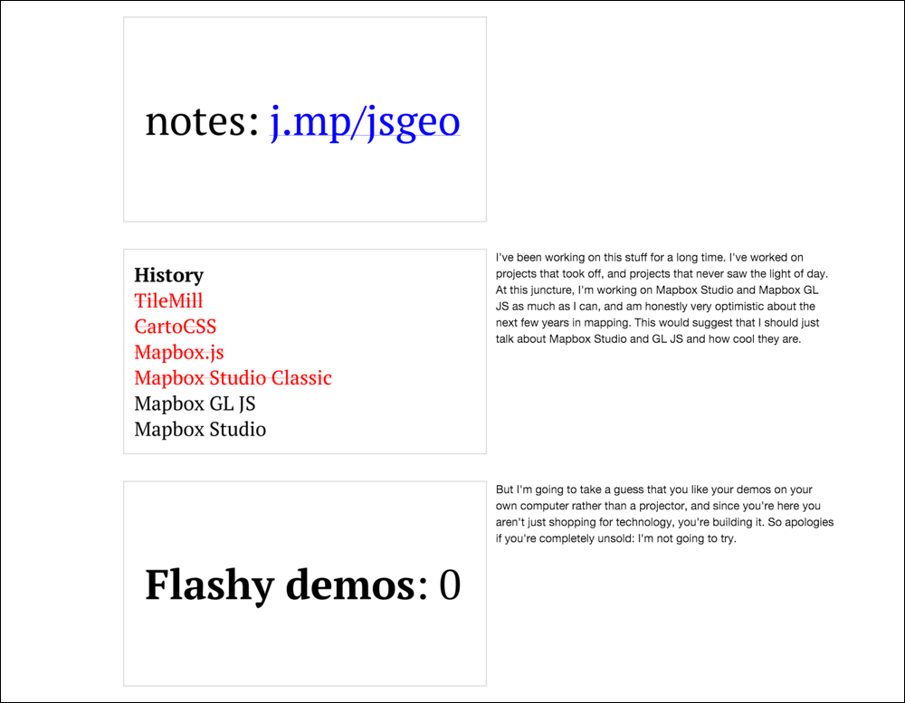

# big-printer

Prints notes for [Big](https://github.com/tmcw/big) presentations.

Big is great for on-screen and on-projector presentations. For the small screen,
when you want to read speakers notes and skim over long presentations, a different
kind of view is optimal. big-printer generates that view: on the left side
are slides (as PNG files), and the right are speakers notes if any.

**screenshot**

## Installation

    npm install -g big-printer

This is a node.js script that wraps phantomjs. It uses a _bundled_ version of
phantomjs, so you don't need to install that separately: you just need node.js,
and when you run the command above it'll set up everything.

## Usage

    big-printer URL OUTPUT

big-printer has two required options

1. The URL of the slide deck. This can be a localhost URL, or remote on a server.
2. A folder name to output slides in. This folder is created and filled with the
   HTML page and images.

For example,

    big-printer http://www.macwright.org/presentations/jsgeo/ jsgeo-notes

## Speakers notes

big-printer integrates with big's speakers notes feature: if you add
a `<notes>` element inside of a slide, it'll show those notes in the developer
console for the real presentation, and in the right column for the big-printer
output.

## Examples

* [big-printer output notes](http://www.macwright.org/presentations/jsgeo/notes/) for
  [Tom MacWright's presentation on How We Got Here](http://www.macwright.org/presentations/jsgeo/)
